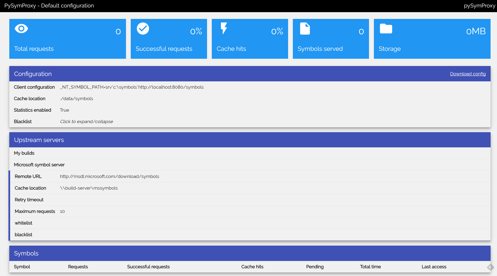

# pySymProxy
pySymProxy is an implementation of a Microsoft Symbol Proxy server using Python.
Symbol proxy servers are used to organise, optimise, and cache debugging symbols from multiple other servers. 

See the following links for information on symbols and symbol servers
  - [Debugging with Symbols](https://msdn.microsoft.com/en-us/library/windows/desktop/ee416588(v=vs.85).aspx)
  - [Symbol Server and Symbol Stores](https://msdn.microsoft.com/en-us/library/windows/desktop/ms680693(v=vs.85).aspx)
  - [SymProxy](https://msdn.microsoft.com/en-us/library/windows/hardware/ff558846(v=vs.85).aspx)
  - [Symbols the Microsoft way](https://randomascii.wordpress.com/2013/03/09/symbols-the-microsoft-way/)  

---
## Features
| Feature | Microsoft SymProxy | pySymProxy | Description |
| ------------- |:-------------:|:-----:|-----|
| Common configuration of symbol search paths | X| X| Configure clients once with the symbol server's details and then all future configuration changes only need to occur on one server. Entire studios can be updated from one place. |
| Global blacklist  | X | X |  Commonly unavailable Symbols can be denied immediately by the service and avoid unnecessary requests and delays to debuggers. |
| Per server blacklist |  | X | Different servers house the artifacts of different builds. If a server will never have a symbol then black list it and don't send the request in the first place. Useful when symbols will exist on one of the servers you reference, so a global blacklist won't help. |
| Per server whitelist |  | X | This might be easier to configure than a per server blacklist. |
| Statistics collection | | X | Logs and statistics about each symbol served are kept and made available on the web interface. These statistics may help you identify further configuration optimisation opportunities. |
| Configurable server retry timeouts | | X| There is no need to query servers over and over again for symbols. If they didn't exist there 5 minutes ago, is it likely they're there now? Configure the timeout that makes sense for each server. |
| Open source | | X | Need another feature? Jump in and implement it :)|
---
## Requirements
| Requirement | Microsoft SymProxy | pySymProxy  |
| ------------- |:-------------:|:-----:|
| Windows | X| X|
| IIS | X| |
| Python | | X|
---
## Why
I was driven to implement this solution when I found myself waiting for symbols on my system to download and run all the time. The reason this had become intolerably slow was because one of the servers we might fetch symbols from exists on the other side of the world. I had configured this server to be last in my symbol search paths so other (faster) servers would get the chance to service the request first. This worked for most symbols, but there are plenty of modules that we simply don't have access to the symbols for. These would always hit the slow server (after hitting the others) and wait for that server to respond to each request (every symbol fetch requires 3 HTTP requests to the remote servers). Some of my colleagues had setup exclusion lists for their configurations, but it became aparrent that these configurations were non-trivial and completely different on each developer's machine.

This sounded like the perfect reason to setup a SymProxy as described by the Microsoft documentation. After attempting configuration of such a proxy, it also became clear that configuring this proxy wasn't going to be easy, and it would still hit the slow path for many of the requests we would make.

---
## Configuration
### Installation
Make sure you are running windows and have python 2.7 installed.
You can clone this repository into a folder on the windows machine.
To run the server, you can run `run_server.bat` in the root folder of the repository.
This will run a server on the machine on port 8080.
`run_server.bat` can be configured as a service on the machine so it automatically starts when the machine reboots. A search online can help with this configuration.

Due to Microsoft not explicitly allowing redistribution od the `dbghelp.dll` files anymore, I can't have them committed directly into the repository. But I can point you to the place to get them: [Debugging Tools for Windows](https://developer.microsoft.com/en-us/windows/hardware/windows-driver-kit). Simply copy/paste the x86 `dbghelp.dll` and `symsrv.dll` to the `dbghelp` directory of the repository. 

### Client configuration
Developers PC's should be configured to reference the pySymProxy service by setting an environment variable on their machine to the following:
`srv*C:\Symbols*http://pysymproxy.company.local:8080/symbols.`

### Checking the status of the server
At any time navigate to the base address of the server in a web browser.
Such as: `http://pysymproxy.company.local:8080/`

### Configuration files
When starting, the server will attempt to load a configuration file.
The following locations will be checked, and the first location that exists will be used as the configuration. 
- `../config/pysymproxy.json`
- `./config/pysymproxy.json`
- `./config/default.pysymproxy.json`
 
The repository has a `./config/default.pysymproxy.json`. It is recommended to copy this file to one of the other locations, then begin to configure the server for your needs.

These files are standard JSON files and contain sections that define how the server is configured.

#### Configuration - `identity` section
- `name` - (string) The title describing the server
- `host` - (string) The name of the host that the server is running on
- `administrator` - (string) Contact information for the server administrator (displayed on the status page),
- `default_sympath` - (string) Client configuration information offered on the status page.

#### Configuration - `general` section
- `enableStatistics` - (boolean) Whether or not statistics should be enabled on the server - may affect performance
- `cacheLocation` - (string) A location on disk where symbols can be cached for serving to clients
- `blacklist` - (list of strings) A list of regular expression patterns. If a requested file matches one of these patterns it will be rejected immediately.

#### Configuration - `servers` section
This section is expected to contain a list of server objects.
When attempting to find symbols, these servers will be searched in the order they are defined in this list.
Each object can have the following properies:
- `name` - (string) The name of this server
- `remote` -  (string) a URL, file path, or network path where symbols are stored as a symbol server
- `cacheLocation` -  (string) optional location on disk where symbols from this specific server can be cached for serving to clients
- `retryTimout` -  (number) The number of seconds to wait after a failed symbol lookup before allowing another request for the same symbol to try again.
- `maxRequests` - (number) Maximum number of simultaneous requests that can be served by this server
- `blacklist` - (list of strings)  A list of regular expression patterns. If a requested file matches one of these patterns it will be rejected immediately by this server.
- `whitelist` - (list of strings)  A list of regular expression patterns. If a requested file does NOT match one of these patterns it will be rejected immediately by this server.

#### Configuration - `logging` section
The config file can have a logging object defined. This defines a dict that is passed to Python's logging modules. This can be used to configure the server to generate log output to disk for later analysis. The default configuration outputs to rotating log files and to the console. See the Python logging documentation for specific details on this section

---
## Known issues
### "Failed to load symbol"
Sometimes when a symbol exists on a remote server, the remote requests aren't serviced quickly enough, and the client (debugger) requesting the symbol treats it as a failure. Often attempting to load the symbol again will hit the cache and immediately load the symbol the second time around. This might be solved in future using chunked encoding streams and generating 0 bytes to keep the connection alive for longer. 

### dbghelp.dll should not be accessed by multiple threads
Yeah, so we're abusing the dbghelp.dll a bit here. The documentation makes no guarantees that the dll will do what it should if it is accessed by multiple threads. This isn't really useful for a webservice - so in an attempt to limit the risk of something bad happening - I've loaded the dll into the process multiple times. Each load of the DLL will only be used by one thread at a time. This still may not guarantee things will work, and it may not even be required in this situation. EAFP is the 'pythonic way' right?

---
## FAQ
### I use local network shares for my symbol storage. Why would I use this?
You probably shouldn't. Local network shares are great and fast.
However there are some useful features that may make it worth trying, such as statistics collection, and the fact that symbol server configuration is managed by the server rather than each developer's individual PC configuration.

### Microsoft has an implementation of a Symbol Proxy (symproxy), why not use that?
Our initial attempts to configure a symproxy as per the documentation failed. Varying versions of IIS, mixed with configuration headaches and legacy installations made it unclear where the issue was. Whilst attempting to configure the server it also became clear that there were desirable configuration settings missing, and the complexity of the task that was being performed by the service wasn't very high. 
So I thought I would give it a shot and write something that worked the way we wanted.

### Why not just use linux? Why use windows?
When initially attempting an implementation I tried to get a symproxy working using just python. This could then have been hosted on a linux server. I ran into trouble when attempting to forward requests to the Microsoft symbol server. This server doesn't accept requests from anything but their software. So the current implementation makes use of the dbghelp.dll and symsrv.dll to build requests for other servers (just as your debugger would).

### How do I store symbols on this symbol server?
This server implementation just serves symbols. It can serve them from a local network share, so the recommended practice here is to "store" your built symbols on a local network share as you normally would. Then configure the server to serve the symbols stored at this location.

---
## Disclaimer
Use at your own risk.
This is the first time I've written a webservice or used python for more than a small script.
If you think you could have done better - you probably could have :)
Please send me your pull requests!

---
## Support
Feel free to create issues if you see something that needs fixing or improvement.
I also welcome pull requests for useful additions and bugfixes.